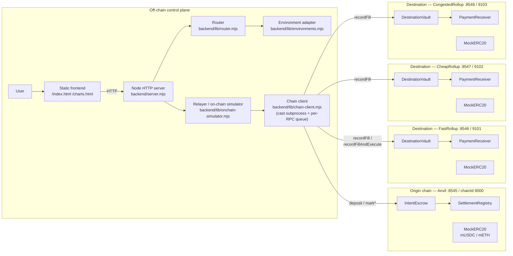
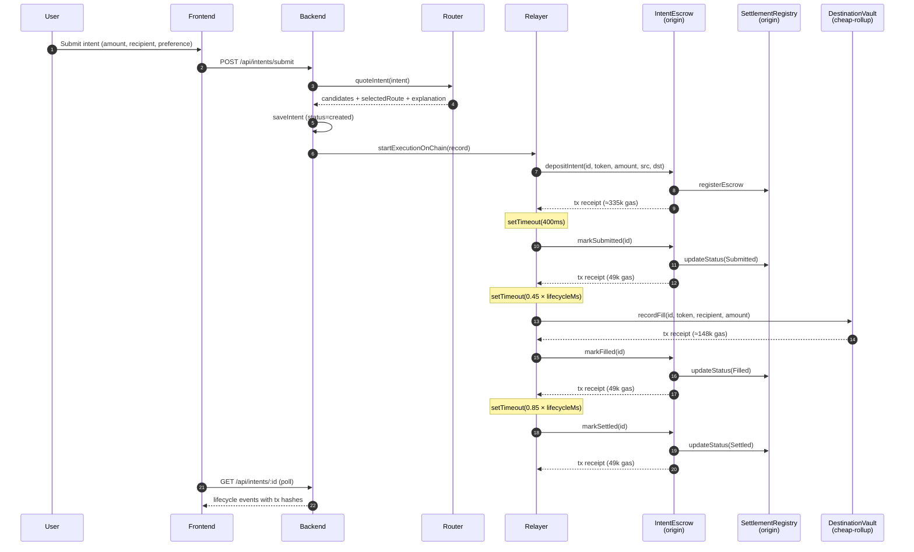
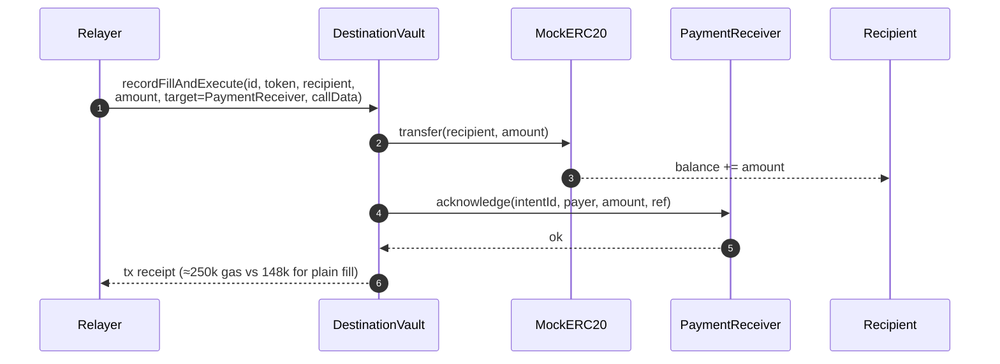
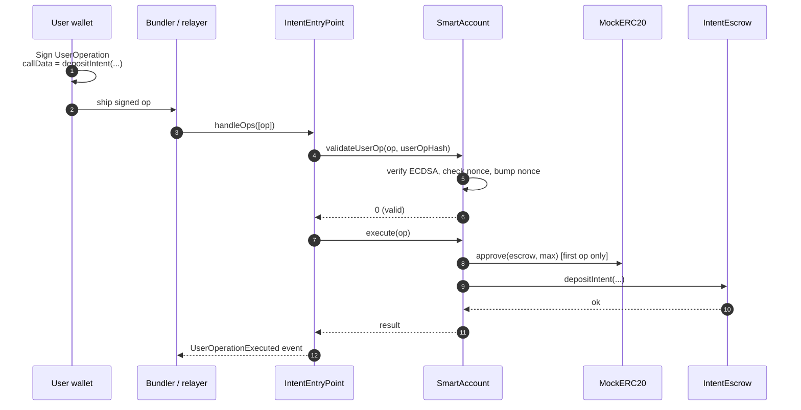
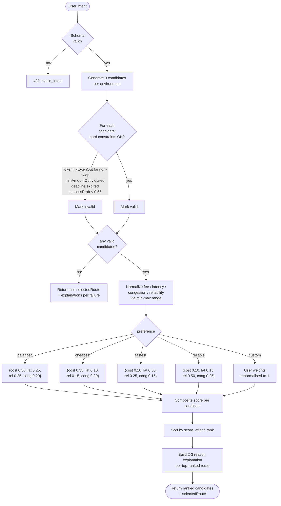
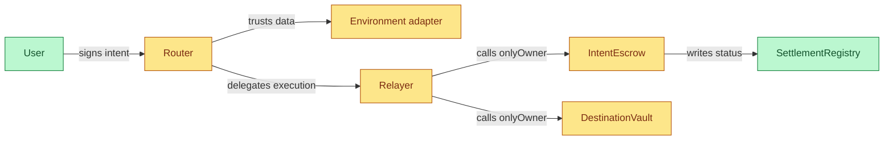
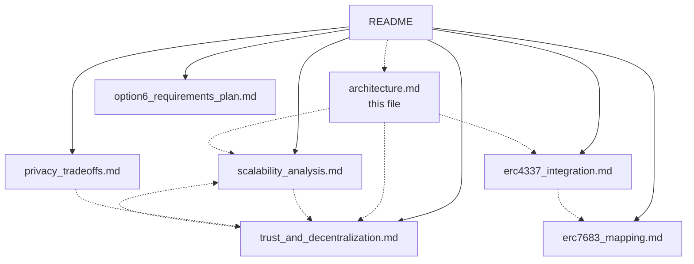

# IntentRoute Architecture

> Diagrams for the prototype. All sequence flows reflect what actually runs in [backend/lib/onchain-simulator.mjs](../backend/lib/onchain-simulator.mjs) when `ONCHAIN_MODE=1`, not an aspirational design.

---

## 1. System components

The off-chain control plane (router + relayer + adapter) sits next to four EVM chains. Settlement and execution touch chain state; routing decisions do not.



Key invariants encoded in this picture:

- Routing is **purely off-chain**. The chains never run the score function.
- The on-chain footprint is **escrow + registry on origin** + **vault + receiver per destination**. There is no synchronous cross-chain call.
- The relayer is the only actor that touches multiple chains within one intent.

---

## 2. Intent lifecycle (on-chain mode, happy path)

For a `transfer` intent settled to `CheapRollup`. Each numbered step is a real transaction signed by the deployer key.



Total wall time ~3-8 seconds depending on `route.estimatedLatencyMs`. Gas budget per intent: ~580k across origin + destination.

---

## 3. Failure / refund path

Triggered when `forceOutcome: "failure"` is set, or when the seeded RNG exceeds `route.successProbability`. The escrow guarantees funds end up back with the depositor and never elsewhere — this is the safety property we surface in [trust_and_decentralization.md](trust_and_decentralization.md#8-one-paragraph-summary-for-the-demo---slides).

```mermaid
sequenceDiagram
  autonumber
  participant RL as Relayer
  participant ES as IntentEscrow
  participant SR as SettlementRegistry
  participant U as User wallet

  Note over RL: decideFailure → true
  RL->>ES: markFailed(id)
  ES->>SR: updateStatus(Failed)
  ES-->>RL: tx receipt (49k gas)

  RL->>ES: refund(id)
  ES->>U: MockERC20.transfer(depositor, amount)
  ES->>SR: updateStatus(Refunded)
  ES-->>RL: tx receipt (~82k gas)

  Note over ES,U: refund() always sends to deposit.depositor.<br/>Funds-stuck is possible (no permissionless<br/>refundAfterDeadline yet); funds-stolen is not.
```

---

## 4. transfer_and_execute (merchant path)

The destination-side fill runs `recordFillAndExecute`, which transfers tokens to the user and then calls a target contract (`PaymentReceiver` by default) inside the same transaction. Any revert in the target rolls back the entire fill.



The gas delta (~100k) is the merchant-side bookkeeping plus the cross-contract call overhead. It is visible in the frontend timeline, which is how the demo justifies the stretch use case empirically.

---

## 5. ERC-4337 layer (when used)

`IntentEntryPoint.handleOps` validates the signature and executes `IntentEscrow.depositIntent` via the smart account. The user signs the intent once; the bundler pays origin-chain gas. See [erc4337_integration.md](erc4337_integration.md) for the prose version.



Note: in the prototype the on-chain simulator does **not** route through `IntentEntryPoint` today — it calls `IntentEscrow.depositIntent` directly with the deployer key. The AA wiring is exercised by [SmartAccount.t.sol](../contracts/test/SmartAccount.t.sol). Moving the simulator onto the EntryPoint is a tier-2 follow-up (see [erc4337_integration.md §5](erc4337_integration.md#5-what-we-did-not-claim-or-implement)).

---

## 6. Routing decision flow

What the router actually does for each `quoteIntent` call.



The four hard-constraint paths and the deterministic weight presets are also the units of `backend/lib/router.test.mjs` — every diamond above has a test that asserts the behaviour.

---

## 7. Trust surface (visual)

A condensed view of [trust_and_decentralization.md §2-3](trust_and_decentralization.md). Each edge is something a user has to trust today.



Yellow nodes are positions where today's prototype concentrates trust into a single party. Green nodes are positions where the on-chain code does not require trust beyond the chain itself. Migrating yellow → green is the agenda of the tier-1/2/3 roadmap in the trust document.

---

## 8. How the documents connect



`README.md` is the entrypoint; everything else is reachable in two hops.
